<div align="center">
  <h1 align="center"><code>⚒️ ark</code></h1>
  <h4 align="center">Agentic Runtime for Kubernetes</h4>
  <p align="center">
    <strong>Technical Preview & RFC. Part of the Agents at Scale Ecosystem</strong>
  </p>
  <p align="center">
    <em>Run agentic workloads across any system or cluster.</em>
  </p>

  <hr>

  <p align="center">
    <a href="#quickstart">Quickstart</a> •
    <a href="https://mckinsey.github.io/agents-at-scale-ark/">Documentation</a>
  </p>
  <p align="center">
    <a href="https://github.com/mckinsey/agents-at-scale-ark/actions/workflows/cicd.yaml"></a>
    <a href="https://www.npmjs.com/package/@agents-at-scale/ark"></a>
  </p>
</div>

## Quickstart

Clone the repository and run the quickstart:

```bash
git clone https://github.com/mckinsey/agents-at-scale-ark.git
cd agents-at-scale-ark
make quickstart
```

User guides, developer guides, operations guides and API reference documentation is all available at:

https://mckinsey.github.io/agents-at-scale-ark/

We are transitioning this project to our open-source repository. During this process we will be moving documentation URLs, artifact registries, etc. Some builds, artifacts and pipelines may be impacted.

## What is ARK?

ARK codifies patterns and practices developed across dozens of client agentic application projects. These projects span multiple sectors, functions, and technology stacks. Through this experience, we identified recurring challenges around platform-agnostic operations for agentic resources and the need for standardized deployment and management approaches.

This project represents the distillation of those learnings into an open-source runtime. While in early access and rapidly evolving based on ongoing team feedback, ARK provides a foundation built on real-world production experience with agentic systems at scale.

## Technical Preview

Agents at Scale - Agentic Runtime for Kubernetes ("Ark") is released as a technical preview and early access release. This software is provided as a Request for Comments (RFC) to share elements of our technical approach with the broader technology community, gather valuable feedback, and seek input from practitioners and researchers in the field of agentic AI systems and Kubernetes orchestration.

As a technical preview release, this software may contain incomplete features, experimental functionality, and is subject to significant changes based on community feedback and continued development. The software is provided "as is" without warranties of any kind, and users should expect potential instability, breaking changes, and limited support during this preview phase.

# Our use case

# 🔄 Diagramme du Workflow - PDF Company Finder

## Architecture du Système

```mermaid
graph TD
    A[👤 Utilisateur] --> B[📱 Interface Streamlit]
    B --> C[📄 Upload PDF]
    C --> D[🔍 Extraction Texte PyPDF2]
    D --> E[🤖 ARK Platform]
    
    E --> F[👥 PDF Company Finder Team]
    
    F --> G[📄 PDF Analyzer]
    G --> H[📁 MCP Filesystem]
    H --> I[📝 Analyse du PDF]
    I --> J[📊 Extraction des Infos]
    
    J --> K[🎯 Project Coordinator]
    K --> L[🔄 Coordination Workflow]
    L --> M[📋 Validation des Données]
    
    M --> N[🏢 Company Finder]
    N --> O[🌐 Web Search Tool]
    O --> P[🔍 Recherche d'Entreprises]
    P --> Q[⭐ Évaluation & Classement]
    
    Q --> R[📊 Résultats Structurés]
    R --> S[🎨 Affichage Streamlit]
    S --> T[📤 Export CSV/JSON]
    
    style A fill:#e1f5fe
    style B fill:#f3e5f5
    style F fill:#fff3e0
    style G fill:#e8f5e8
    style K fill:#fff8e1
    style N fill:#e3f2fd
    style S fill:#f1f8e9
```



## Workflow Détaillé des Agents

```mermaid
sequenceDiagram
    participant U as 👤 Utilisateur
    participant S as 📱 Streamlit
    participant T as 👥 Team
    participant PA as 📄 PDF Analyzer
    participant PC as 🎯 Project Coordinator
    participant CF as 🏢 Company Finder
    participant MCP as 📁 MCP Filesystem
    participant WS as 🌐 Web Search
    
    U->>S: Upload PDF
    S->>S: Extract text with PyPDF2
    S->>T: Create Query with PDF content
    
    T->>PA: 1. Analyze PDF
    PA->>MCP: Read PDF content
    MCP-->>PA: PDF text
    PA->>PA: Extract project info
    PA-->>T: Structured project data
    
    T->>PC: 2. Coordinate workflow
    PC->>PC: Validate & enrich data
    PC-->>T: Coordinated project description
    
    T->>CF: 3. Find companies
    CF->>WS: Search for companies
    WS-->>CF: Company information
    CF->>CF: Evaluate & rank companies
    CF-->>T: Top 5 companies
    
    T-->>S: Complete results
    S->>U: Display companies with ratings
    U->>S: Export results (CSV/JSON)
```



## Architecture des Agents

```mermaid
graph LR
    subgraph "🎯 PDF Company Finder Team"
        direction TB
        PA[📄 PDF Analyzer<br/>Document Analysis]
        PC[🎯 Project Coordinator<br/>Workflow Orchestrator]
        CF[🏢 Company Finder<br/>Business Research]
        
        PA --> PC
        PC --> CF
    end
    
    subgraph "🛠️ Tools & Services"
        MCP[📁 MCP Filesystem<br/>File Operations]
        WS[🌐 Web Search<br/>DuckDuckGo API]
        GPT[🤖 GPT-4.1<br/>AI Model]
    end
    
    subgraph "📱 User Interface"
        ST[📱 Streamlit App<br/>PDF Upload & Results]
        EXP[📤 Export<br/>CSV/JSON]
    end
    
    PA -.-> MCP
    CF -.-> WS
    PA -.-> GPT
    PC -.-> GPT
    CF -.-> GPT
    
    ST --> PA
    CF --> ST
    ST --> EXP
    
    style PA fill:#e8f5e8
    style PC fill:#fff8e1
    style CF fill:#e3f2fd
    style MCP fill:#f3e5f5
    style WS fill:#e1f5fe
    style GPT fill:#fff3e0
    style ST fill:#f1f8e9
```



## Résumé des Composants

| Composant | Rôle | Technologies |
|-----------|------|--------------|
| **PDF Analyzer** | Analyse les documents PDF | PyPDF2, MCP Filesystem |
| **Project Coordinator** | Coordonne le workflow | GPT-4.1, ARK Platform |
| **Company Finder** | Recherche les entreprises | Web Search, GPT-4.1 |
| **MCP Filesystem** | Gestion des fichiers | Go, MCP Protocol |
| **Web Search** | Recherche web | DuckDuckGo API |
| **Streamlit App** | Interface utilisateur | Python, Streamlit |
| **ARK Platform** | Orchestration | Kubernetes, Go |

## Points Clés du Workflow

1. **📄 Input** : PDF d'appel d'offres uploadé par l'utilisateur
2. **🔍 Extraction** : Texte extrait avec PyPDF2
3. **🤖 Analyse** : 3 agents travaillent en séquence
4. **🌐 Recherche** : Web search pour trouver les entreprises
5. **⭐ Évaluation** : Classement et rating des entreprises
6. **📊 Résultats** : Affichage visuel avec export possible


## Contributor
Ewinsou Roméo

Snaj Nihal

Oumaima Hammi

Jean-claude MITCHOZOUNOU
